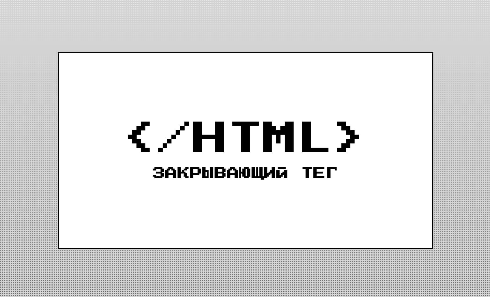
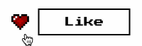
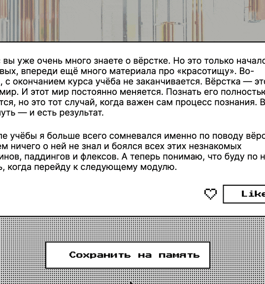

# Закрывающий тег — сайт об изучении верстки

«Закрывающий тег» — это итоговый учебный проект, завершающий модуль «Верстка» в рамках курса «Фронтенд-разработчик» от «Яндекс Практикума». Представляет из себя страницу с резиновым интерфейсом и постами, которые можно лайкать.

## Технологии

&nbsp;&nbsp;&nbsp;HTML5

&nbsp;&nbsp;&nbsp;CSS3

## Особенности

- Резиновая верстка, адаптирующаяся под ширину экрана

- Сложный фоновый паттерн на основе градиентов

  

  
  

- Анимированная кнопка лайка

  

  
  

- Модальное окно для подтверждения сохранения

  

  
  

## Цели проекта

В рамках этого проекта я освоил и успешно применил следующие навыки:

- работа с вариативными шрифтами

- создание сложных паттернов на основе множественных градиентов

- создание резиновой верстки с помощью функции clamp

- использование директивы @supports и прописывания фоллбэков

- создание и верстка всплывающих окон

- применение CSS-фильтров

- анимации с помощью transition и @keyframes

- анимирование SVG-графики с помощью изменения свойств различных путей (path)
